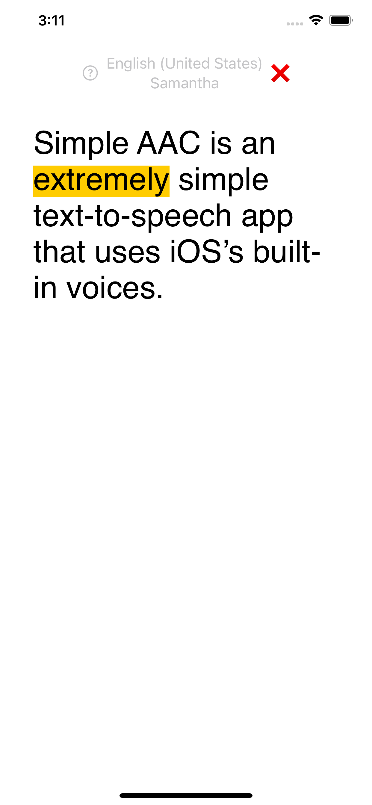
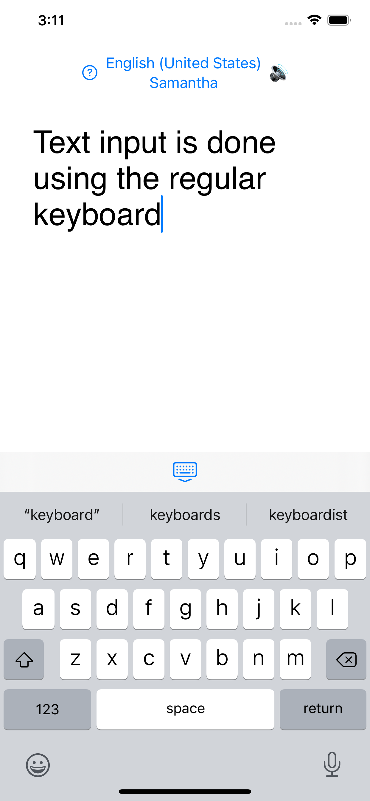

# Simple AAC

Extremely simple text-to-speech app that uses iOS's built-in voices. Text input is done using the regular keyboard (or any other input device that iOS might support). And it even supports languages that aren't English, if the voices are installed.

All source code in this repository is hereby released into the public domain. For more information see COPYING

  &nbsp;
  &nbsp;
  &nbsp;

